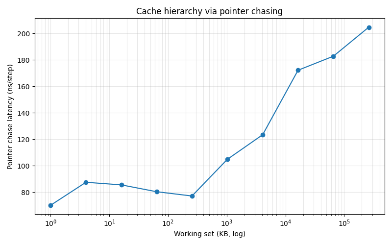

# 02_cache_hierarchy_report.md: Analysis of Api Utilization and Memory Hierarchy Dynamics

본 실험은 [02_cache_hierarchy_bench.py](../lab/02_cache_hierarchy_bench.py)를 통해 현대적 CPU 아키텍처에서 소프트웨어 최적화(Prefetcher 무력화 및 캐시 지역성 활용)가 하드웨어 성능 끌어내기에 미치는 영향력을 정량적으로 검증하는 데 중점을 둡니다.

> **💡 이론적 배경 확인**: 본 실험의 근간이 되는 메모리 계층 구조의 물리적 특성 및 하드웨어 개념 정리는 [02_memory_subsystem.md](./02_memory_subsystem.md) 문서에서 상세히 다루고 있습니다.

---

## 1. 실험 1: Pointer Chasing을 활용한 캐시 위계 분석

이 실험은 메모리 접근의 지연 시간($latency$)을 측정하여 CPU 내부의 캐시 구조(L1, L2, L3) 및 DRAM의 성능 경계를 식별하는 것을 목적으로 합니다.

### 1.1 데이터 생성 및 포인터 체이싱 메커니즘
메모리 접근의 무작위성을 확보하여 CPU의 예측 기능을 무력화하기 위해 다음과 같은 난수 순열 생성 API를 활용합니다.

* **인덱스 생성**: `perm = np.random.permutation(n).astype(np.int64)`
* **요소 개수 계산**: $int64$ 자료형이 8바이트를 차지한다는 점을 고려하여, 테스트하고자 하는 $KB$ 단위의 크기를 기반으로 요소 개수 $n$을 다음과 같이 산출합니다.
    * $n = \max(2, size\_kb \times 1024 // 8)$
* **동작 원리**: 배열의 각 요소가 다음 접근할 인덱스를 담고 있게 하여, `i = int(perm[i])`와 같은 방식으로 꼬리에 꼬리를 무는 포인터 추적(Pointer Chasing)을 수행합니다. 이는 하드웨어가 다음 데이터를 미리 가져오는 $prefetcher$ 기능을 무력화하여 순수한 메모리 접근 시간을 측정하게 합니다.

### 1.2 측정 단계 및 정밀도 확보
실험의 정확도를 높이기 위해 다음과 같은 3단계 프로세스를 거칩니다.

1.  **사전 셋업 및 환경 설정 (Initial Setup & Environment Configuration)**: 본격적인 메모리 접근 시간 측정에 앞서, 연산 과정에서 발생할 수 있는 불필요한 수치적 예외 경고를 선제적으로 차단하여 측정 환경의 노이즈를 완벽하게 제거하는 필수 단계입니다.
    ```python
    np.seterr(over="ignore", divide="ignore", invalid="ignore")
    ```
***
2. **무작위 순열(Permutation) 생성**: CPU의 예측 기능을 차단하기 위해 데이터 접근 경로를 설계하는 핵심 단계입니다.

* **요소 개수($n$) 산출**: `n = max(2, size_kb * 1024 // 8)` 공식을 사용합니다.
    * 이는 `int64` 자료형이 8바이트(byte)이므로, 전체 바이트 크기를 8로 나눈 몫을 데이터 개수로 사용하기 위함입니다.
* **순열 생성 API**: `perm = np.random.permutation(n).astype(np.int64)`
    * **의미**: $0$부터 $n-1$까지의 인덱스를 무작위 순서로 섞으며, 모든 인덱스가 정확히 한 번씩만 등장하도록 보장합니다.
    * **데이터 타입**: 모든 데이터를 8바이트 정수(`int64`)로 통일하여 메모리 정렬 및 처리 속도의 일관성을 확보합니다.
* **동작 원리**: `perm[i]`는 어떤 무작위 인덱스 $j$를 가리키게 되며, `i = perm[i]` 연산을 반복하면 예측 불가능한 다음 위치로 계속 이동하게 됩니다.
***
3.  **Warmup 단계**: 측정 전 약 1,000번의 예비 실행을 통해 캐시를 미리 채워줌으로써 첫 측정 시 발생하는 오차를 방지합니다.
* **수행 방식**: 본격적인 시간 측정 전 약 $1,000$번(또는 $n$이 작을 경우 $n$번)의 포인터 추적 연산을 미리 수행합니다.
* **수행 코드**: 
    ```python
    i = 0
    for _ in range(min(1000, n)):
        i = int(perm[i])
    ```
    * **목적**: 측정 전에 캐시를 어느 정도 채움으로써 첫 측정 시 발생하는 **Cold-miss**(데이터가 캐시에 없어 발생하는 추가 지연) 영향을 제거하여 일관된 지연 시간을 얻기 위함입니다.
***
4.  **본격 측정**: `time.perf_counter()`를 사용하여 정밀한 시간을 기록하며, 약 200,000번의 반복 접근을 통해 평균 나노초($ns$) 단위 시간을 계산합니다.
    ```python
    t0 = time.perf_counter()
    i = 0
    for _ in range(steps_per_size): # 200,000 번
        i = int(perm[i]) # 핵심 로직
    elapsed = time.perf_counter() - t0
    times_ns.append(elapsed / steps_per_size * 1e9)
    ```
    * **시간 측정 방식**: `time.perf_counter()`를 사용하여 루프 시작 전($t0$)과 종료 후의 시간 차이를 계산합니다. 약 $200,000$회의 반복을 수행합니다.
    * **지연 시간 계산**: `times_ns.append(elapsed / steps_per_size * 1e9)` 공식을 통해 한 번의 메모리 접근에 걸리는 시간(ns/step)으로 환산합니다.
    * **포인터 체이싱(Pointer Chasing)의 핵심**: `i = int(perm[i])` 코드가 핵심입니다.

    | 구분 | 일반 순차 접근 | Pointer Chasing |
    | :--- | :--- | :--- |
    | **접근 패턴** | `arr[0], arr[1], arr[2], ...` | `arr[5], arr[83], arr[12], ...` |
    | **CPU 예측** | 다음 주소 예측 가능 | 현재 연산 결과를 봐야 다음 주소 파악 가능 |
    | **Prefetcher** | 미리 데이터를 캐시에 채움 | 예측 실패로 인해 **무력화**됨 |
    | **측정 대상** | 최적화된 처리량 | **진짜 캐시 지연 시간(Latency)** |

### 1.3 시각화 및 결과 해석
측정된 데이터는 다양한 메모리 크기 범위($1$ $KB$ ~ $256$ $MB$)에서 관찰하기 위해 로그 스케일 그래프로 표현합니다.



그림 1: 포인터 체이싱을 통해 측정된 메모리 크기별 접근 지연 시간(ns)

* **성능 패턴 분석**:
    * **L1/L2 Cache**: 약 $52 \sim 58$ $ns$ 수준의 최소 지연 시간을 유지하며, Python 오버헤드를 제외한 순수 로직이 상주하는 구간입니다.
    * **L3 transition**: 데이터 크기가 1MB를 초과함에 따라 지연 시간이 약 $75$ $ns$ 수준으로 급격히 증가하기 시작합니다.
    * **DRAM & TLB Penalty**: $64$ $MB$ 이상의 영역에서는 약 $110 \sim 150$ $ns$까지 지연 시간이 늘어나며, L3 캐시 용량 한계와 TLB 범위를 벗어나는 Random Access의 영향이 관찰됩니다.

---

## 2. 실험 2: NumPy Axis Sum (Row vs Column) 분석

이 실험은 데이터가 메모리에 배치된 방식(Layout)과 접근 방향이 실제 연산 속도에 미치는 영향을 분석합니다.

### 2.1 메모리 배치: C-contiguous 방식
NumPy 배열은 기본적으로 행(Row) 방향으로 데이터가 연속적으로 저장되는 **C-contiguous** 배치를 따릅니다.
* **메모리 구조**: `A[0,0], A[0,1], ..., A[0,N-1]` 순서로 0번 행의 요소들이 먼저 나열되고 그 뒤에 1번 행이 이어집니다.

### 2.2 접근 패턴에 따른 성능 차이
연산 방향(`axis`)에 따라 CPU 캐시의 효율성이 결정됩니다.

* **행 방향 합 (axis=1)**: `s_row = A.sum(axis=1)`. 메모리에 인접한 요소들을 순차적으로 읽기 때문에 캐시 히트($cache$ $hit$) 확률이 극대화되어 연산 속도가 매우 빠릅니다.
* **열 방향 합 (axis=0)**: `s_col = A.sum(axis=0)`. 다음 요소를 읽기 위해 메모리상에서 멀리 떨어진 위치로 점프해야 하므로 캐시 미스($cache$ $miss$)가 빈번하게 발생하여 속도가 저하됩니다.

### 2.3 결과 검증 및 플랫폼별 최적화 분석 (Validation & Platform Optimization)

본 실험에서는 행 방향 합(axis=1)과 열 방향 합(axis=0)의 결과가 수치적으로 동일한지 확인하기 위해 검증 과정을 거칩니다.

* **수치적 일치성 검증**: `np.allclose(s_row.sum(), s_col.sum(), rtol=1e-3)`를 사용하여 두 연산 결과의 합이 허용 오차 범위 내에 있는지 확인합니다.
    * **rtol(상대 오차)**: $1e-3$ 수준으로 설정하여 대규모 행렬 연산에서 발생할 수 있는 미세한 부동소수점 누적 오차를 허용합니다.
* **Streaming Reduction의 하드웨어적 의미**: 최신 가속 라이브러리는 axis=0 연산 시에도 메모리를 행(Row) 방향으로 순차 스캔(Sequential Scan)합니다. 
    * 각 행을 읽을 때마다 결과 벡터(Column sum)의 해당 위치에 누적하는 방식을 취합니다. 결과 벡터가 L1 캐시에 들어갈 만큼 충분히 작다면, 열 방향 접근임에도 불구하고 **메모리 읽기는 연속적(Contiguous)** 으로 수행되어 성능 저하를 방지할 수 있습니다.

---

## 3. 실험 종합 비교 요약 (Comprehensive Comparison)

두 실험의 주요 차이점과 분석 포인트를 정리하면 다음과 같습니다.

| 분석 측면 | 실험 1: Pointer Chasing | 실험 2: NumPy Axis Sum |
| :--- | :--- | :--- |
| **주요 목적** | 하드웨어 캐시 계층(L1/L2/L3/DRAM) 식별 | 메모리 접근 패턴(Row vs Col)의 효율성 분석 |
| **핵심 코드** | `i = int(perm[i])` (간접 참조 루프) | `A.sum(axis=0)` vs `A.sum(axis=1)` |
| **측정 도구** | Python 루프 + `time.perf_counter()` | NumPy 라이브러리 내장 함수 |
| **성능 결정 요인** | 메모리 접근 지연 시간 (Latency) | 메모리 대역폭 및 캐시 활용도 (Throughput) |
| **플랫폼 의존성** | 낮음 (대부분의 CPU에서 일정한 경향성 보임) | 높음 (라이브러리 버전 및 아키텍처에 따라 상이) |

---

## 4. 문제 해결 및 디버깅 가이드 (Troubleshooting)

실험 중 발생할 수 있는 주요 오류 상황과 이에 대한 대응 방안입니다.

* **성능 차이가 관찰되지 않는 경우**:
    * **원인**: Warmup 단계가 누락되었거나 반복 측정 횟수(`steps_per_size`)가 너무 적어 통계적 유의성이 부족할 때 발생합니다.
    * **해결**: 측정 전 예비 실행 루프를 확인하고, 반복 횟수를 $200,000$회 이상으로 충분히 설정합니다.
* **MemoryError (메모리 부족)**:
    * **원인**: 시스템 RAM 용량을 초과하는 대규모 배열을 생성하려고 할 때 발생합니다.
    * **해결**: 최대 데이터 크기를 $64$ $MB$ 수준으로 축소하여 테스트를 진행합니다.
* **검증 실패 (Assertion Error)**:
    * **원인**: 부동소수점 연산 특성상 합산 순서에 따라 결과가 아주 미세하게 달라질 수 있습니다.
    * **해결**: `rtol` 및 `atol` 파라미터를 적절히 조절하여 허용 범위를 넓힙니다.
* **환경 경고 메시지**:
    * **원인**: Apple Silicon 등 특정 환경에서 가속 라이브러리와 관련된 런타임 경고가 발생할 수 있습니다.
    * **해결**: `np.seterr(over="ignore", ...)` 설정을 통해 불필요한 경고 출력을 제어합니다.

---

## 5. 결론 (Conclusion)

본 보고서의 실험을 통해 동일한 알고리즘과 데이터를 사용하더라도 **메모리 접근 패턴**과 **데이터 배치 방식**에 따라 시스템 성능이 수 배 이상 달라질 수 있음을 수치적으로 확인하였습니다.

1.  **실험 1**을 통해 CPU 캐시의 물리적 계층 구조가 접근 지연 시간($Latency$)에 직접적인 영향을 미침을 입증하였습니다.
2.  **실험 2**를 통해 소프트웨어 수준에서 데이터를 어떻게 배치하고 접근하느냐에 따라 하드웨어 자원의 활용도가 극적으로 변할 수 있음을 확인하였습니다.

결과적으로, 고성능 컴퓨팅 환경에서 효율적인 코드를 작성하기 위해서는 단순히 논리적인 정확성을 넘어 **캐시 친화적(Cache-friendly)** 인 프로그래밍 설계가 필수적이라는 점을 시사합니다.

---

## 💡 참고 사항 (Notes)

### 1. 프로젝트 아카이브 연결 고리 (A-L-M Linkage)
본 보고서는 프로젝트의 전반적인 학습 아키텍처와 긴밀하게 연결되어 있으며, 각 요소는 상호 보완적인 역할을 수행합니다.

* **실습 소스 코드 (Lab)**: 본 분석의 기초가 되는 실험 데이터는 [02_cache_hierarchy_bench.py](../lab/02_cache_hierarchy_bench.py)에서 직접 실행 및 수정이 가능합니다. 특히 `steps_per_size` 파라미터를 조정하여 통계적 유의성을 실험적으로 검증할 수 있습니다.
* **시각적 지표 (Visualization)**: 실험을 통해 도출된 캐시 계층별 레이턴시 계단 현상은 [02_working_set_result.png](../lab/results/02_working_set_result.png)에서 그래프 형식으로 확인 가능하며, 이는 본 보고서의 1.3절 분석 내용을 시각적으로 뒷받침합니다.
* **숙련도 검증 (Mastery)**: 본 보고서에서 다룬 하드웨어-소프트웨어 간의 상호작용 개념과 캐시 지역성 원리에 대한 심화 이해도는 [02_memory_latency.md](../mastery/02_memory_latency.md)의 퀴즈 및 요약 자료를 통해 자가 진단할 수 있습니다.
* **상위 아키텍처 맥락**: 본 실험은 시스템 기초 단계의 핵심 과정으로, 전체 학습 로드맵 내에서의 위치와 다음 단계로의 연결성은 [01_system_foundations/README.md](../README.md) 및 최상위 [README.md](/README.md)에서 조망할 수 있습니다.

### 2. 기술적 심화 분석 및 제약 사항
고성능 시스템 프로그래밍 관점에서 고려해야 할 추가적인 변수들입니다.

* **OS 스케줄링 및 인터럽트 오버헤드**: 실측된 레이턴시 값에는 운영체제의 컨텍스트 스위칭 및 백그라운드 프로세스에 의한 노이즈가 포함될 수 있습니다. 보다 정밀한 측정을 위해 실시간 OS(RTOS) 환경이나 프로세서 격리(CPU Isolation) 기법의 필요성을 시사합니다.
* **TLB(Translation Lookaside Buffer) 미스**: 실험 1의 64MB 이상 구간에서 나타나는 급격한 지연 시간 증가는 단순히 L3 캐시 용량 초과뿐만 아니라, 가상 주소를 물리 주소로 변환하는 TLB의 범위를 벗어나면서 발생하는 페이징 오버헤드가 복합적으로 작용한 결과입니다.
* **플랫폼 특이적 최적화**: 실험 2에서 관찰된 `Streaming Reduction` 현상은 사용 중인 하드웨어 가속 라이브러리(예: Apple Accelerate, OpenBLAS)의 내부 구현 방식에 따라 이론적 예측과 반대되는 결과를 낼 수 있습니다. 이는 하드웨어 인지적 알고리즘 설계가 특정 플랫폼에 종속적일 수 있음을 보여주는 사례입니다.

### 3. 향후 확장 가능성
본 실험의 데이터는 향후 [03_npu_prototyping](../../03_npu_prototyping) 단계에서 가속기 설계를 위한 메모리 서브시스템의 파라미터(Cache Line Size, Associativity)를 결정하는 중요한 설계 근거(Design Rationale)로 활용될 예정입니다.