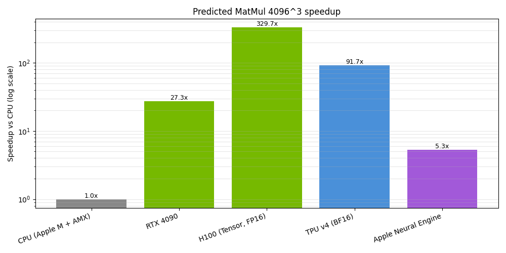

# 05_hw_architecture_report.md: CPU/GPU/NPU Comparative Analysis through the Roofline Model

본 보고서는 [05_hw_architecture_bench.py](../lab/05_hw_architecture_bench.py) 실습을 바탕으로 작성되었으며, **Roofline Model**을 이용하여 동일한 행렬곱(Matrix Multiplication) 연산이 CPU, GPU, NPU 등 서로 다른 하드웨어 아키텍처에서 어떻게 수행되고 성능 차이가 발생하는지를 이론적으로 예측하고 분석합니다.

> **💡 이론적 배경 확인**: 본 실험에서 사용한 NPU의 정성적 차이(Systolic Array, Scratchpad)와 정밀도(dtype)에 따른 Lane 밀도 가속 원리에 대한 이론적 설명은 [05_hw_architecture_comp.md](./05_hw_architecture_comp.md) 문서에서 상세히 다루고 있습니다.

---

## 1. 실습 개요 및 목적

* **목적**: 하드웨어 아키텍처별 파라미터(Peak 성능, Bandwidth, Reuse Factor)를 Roofline Model에 대입하여 행렬곱 연산 성능을 정량적으로 예측합니다.
* **사용 환경**: Apple MacBook Pro with M4 (CPU 기준 작성).
* **비교 대상 하드웨어**:
* **CPU**: Apple M-class + AMX (Baseline)
* **GPU**: NVIDIA GeForce RTX 4090
* **Data Center GPU**: NVIDIA H100 SXM
* **Cloud AI Accelerator**: Google TPU v4
* **On-device NPU**: Apple Neural Engine

---

## 2. 코드 및 로직 분석

`roofline()` 함수는 주어진 행렬 크기와 하드웨어 정보를 바탕으로 예상 실행 시간과 병목 유형을 계산합니다.

1. **총 연산량 계산**: `flops = 2 * n * m * k`
2. **실제 메모리 전송량 추정**: `bytes_actual = (n * k + k * m + n * m) * hw.dtype_bytes / hw.reuse`
* `hw.reuse`(재사용 계수)를 통해 캐시 및 로컬 메모리 활용 능력을 반영합니다.

3. **연산 시간 계산**: `t_c = flops / hw.peak_ops_per_sec`
4. **메모리 시간 계산**: `t_m = bytes_actual / hw.peak_bw_bps`
5. **병목 판정**: `return (t_c, "compute") if t_c >= t_m else (t_m, "memory")`

---

## 3. Roofline Model 핵심 이론

Roofline Model은 하드웨어 성능이 다음 두 가지 제약 중 **더 느린(시간이 더 오래 걸리는) 쪽**에 의해 결정된다고 정의합니다.

* **핵심 공식**: $T = \max(T_{compute}, T_{memory})$
* **연산 시간 ($T_{compute}$)**: $\frac{FLOPs}{Peak\ Ops/s}$
* **메모리 전송 시간 ($T_{memory}$)**: $\frac{Bytes}{Bandwidth}$

---

## 4. 행렬곱 연산 분석 (MatMul $4096^3$)

### 4.1 연산량 및 데이터 특성

* **총 연산량**: $4096 \times 4096$ 행렬곱의 총 연산량은 $2N^3$입니다.
* $N=4096$일 때, 약 **137.4 GFLOP**의 연산이 필요합니다.

* **병목 유형**: 모든 하드웨어에서 **Compute Bound**로 나타났습니다.
* **이유**: 행렬곱은 산술 연산 밀도($AI = \frac{FLOPs}{Bytes}$)가 매우 높기 때문입니다.
* 같은 데이터를 여러 번 재사용하므로, 메모리 대역폭보다 연산 장치의 처리 능력이 최종 성능을 결정하게 됩니다.

---

## 5. 하드웨어별 성능 예측 결과

### 5.1 실측 및 예측 데이터 요약 테이블

정밀도를 $FP32$에서 $FP16$ 또는 $INT8$로 낮춤으로써 하드웨어는 동일 시간당 더 많은 데이터를 처리($Effective\ TOPS$ 상승)하고 전력 효율을 극대화할 수 있습니다.

| Hardware | dtype | Peak T | BW GB/s | time ms | TOPS meas | bound | speedup |
| --- | --- | --- | --- | --- | --- | --- | --- |
| **CPU (Apple M + AMX)** | fp32 | 3.0 | 200 | 45.8130 | 3.0 | compute | 1.0x |
| **RTX 4090** | fp32 | 82.0 | 1008 | 1.6761 | 82.0 | compute | 27.3x |
| **H100 (Tensor, FP16)** | fp16 | 989.0 | 3350 | 0.1390 | 989.0 | compute | 329.7x |
| **TPU v4 (BF16)** | bf16 | 275.0 | 1200 | 0.4998 | 275.0 | compute | 91.7x |
| **Apple Neural Engine** | int8 | 15.8 | 100 | 8.6987 | 15.8 | compute | 5.3x |

### 5.2 하드웨어별 상세 분석

#### CPU (Apple M + AMX)

* **특징**: Apple Silicon에 포함된 행렬 연산 가속 기능인 AMX를 활용합니다.
* **성능**: 약 3 TFLOPS로 가정하였으며, 예측 시간은 **45.8 ms**입니다. 이 값은 타 하드웨어 성능 비교의 기준점이 됩니다.

#### NVIDIA GeForce RTX 4090

* **성능**: FP32 기준 약 82 TFLOPS를 제공합니다.
* **예측**: 실행 시간 **1.68 ms**, CPU 대비 **27.3배** 빠릅니다.
* **통찰**: 딥러닝 학습과 추론에서 일반 소비자용 GPU가 왜 압도적인 효율을 보이는지 증명합니다.

#### NVIDIA H100 Tensor Core

* **성능**: FP16 기준 약 **989 TFLOPS**를 제공하는 현존 최강의 데이터센터 GPU입니다.
* **예측**: 실행 시간 **0.139 ms**, CPU 대비 무려 **329.7배** 빠릅니다.
* **통찰**: 대규모 거대언어모델(LLM) 학습에 필수적인 하드웨어임을 수치로 확인할 수 있습니다.

#### Google TPU v4

* **성능**: BF16 기준 약 275 TFLOPS 수준으로 가정하였습니다.
* **예측**: 실행 시간 **0.50 ms**, CPU 대비 **91.7배** 빠릅니다.
* **통찰**: 구글의 대규모 AI 인프라 환경에서 범용 GPU를 대체하는 전용 가속기의 위력을 보여줍니다.

#### Apple Neural Engine (ANE)

* **성능**: INT8(저정밀도) 기반으로 약 15.8 TOPS를 제공합니다.
* **예측**: 실행 시간 **8.70 ms**, CPU 대비 **5.3배** 빠릅니다.
* **통찰**: 전력 소모가 제한적인 모바일 기기(온디바이스 AI)에서 추론 전용 NPU가 수행하는 최적화된 역할을 보여줍니다.

---

## 6. 핵심 결론 및 교육적 의미

### 6.1 핵심 결론

* 동일한 행렬곱 알고리즘일지라도 하드웨어가 제공하는 **Peak Compute 성능**과 **Memory Bandwidth**의 조합에 따라 실제 실행 시간은 수백 배까지 차이 날 수 있습니다. 특히 데이터 재사용성이 높은 AI 워크로드에서는 연산 성능(TFLOPS/TOPS)이 가속의 핵심입니다.

* PCIe/Interconnect 오버헤드: 본 보고서의 예측치는 칩 내부 연산에 집중하고 있으나, 실제 환경에서는 $4096^3$ 행렬곱 시 발생하는 약 $200\text{ MB}$의 데이터를 전송하는 H2D(Host-to-Device) 시간이 순수 연산 시간($0.139\text{ ms}$)보다 수십 배 길어질 수 있습니다. 즉, 실제 시스템에서는 커널 실행 시간뿐만 아니라 호스트-가속기 간의 데이터 전송 오버헤드가 전체 성능(End-to-End Latency)을 지배할 수 있음을 유의해야 합니다.

### 6.2 교육적 의미

본 실습은 다음과 같은 시스템 엔지니어링의 핵심 원리를 시사합니다.

1. **아키텍처의 영향**: 알고리즘이 같아도 하드웨어의 특성에 따라 성능은 극명하게 달라집니다.
2. **성능의 결정 요인**: 클럭 속도(Clock Speed)보다 중요한 것은 **FLOPS**와 **Memory Bandwidth** 간의 균형입니다.
3. **산술 연산 밀도**: 행렬곱은 높은 AI 덕분에 전형적인 **Compute Bound** 작업이 됩니다.
4. **병렬화의 가치**: GPU, TPU, NPU는 행렬 연산을 극한으로 병렬화하여 성능을 극대화하도록 설계되었습니다.
5. **AI 성능의 본질**: 현대 AI 시스템의 경쟁력은 결국 대규모 행렬곱 연산을 얼마나 빠르게 수행하느냐에 달려 있습니다.

---

## 7. 요약

**Roofline Model**은 특정 작업이 '계산 능력' 때문에 느린지, '메모리 전송 속도' 때문에 느린지를 명확히 구분해 줍니다. 본 보고서는 이를 통해 CPU, GPU, TPU, NPU 간의 성능 차이를 정량적으로 증명한 가장 직관적인 성능 분석 결과입니다.

특히 아키텍처와 정밀도에 따라 **TFLOPS**(부동소수점)와 **TOPS**(정수형) 단위를 혼용하여 사용하지만, Roofline 성능 모델 상에서는 이를 '초당 총 연산량($Ops/s$)'이라는 동일한 물리적 관점으로 통합하여 분석할 수 있음을 확인하였습니다.

---

## 💡 참고 사항 (Notes)

### 1. 프로젝트 아카이브 연결 고리 (A-L-M Linkage)
* **실습 소스 코드 (Lab)**: 본 보고서의 데이터 도출에 사용된 5종 하드웨어 비교 벤치마크 및 그래프 생성 코드는 [05_hw_architecture_bench.py](../lab/05_hw_architecture_bench.py)에서 확인 가능합니다.
* **시각적 지표 (Visualization)**: 아키텍처별 가속 배율을 로그 스케일로 시각화한 결과는 [05_cpu_gpu_npu_compare.png](../lab/results/05_cpu_gpu_npu_compare.png)에서 확인 가능하며, 본 보고서의 5.1절 수치를 직관적으로 증명합니다.
* **이론적 배경 (Analysis)**: NPU가 GPU보다 빠른 4가지 핵심 요인(저정밀도, 고정 패턴, 데이터 이동 통제 등)에 대한 이론적 배경은 [05_hw_architecture_comp.md](./05_hw_architecture_comp.md)에 기술되어 있습니다.

### 2. 데이터 해석 가이드
* 본 보고서의 **H100 (329.7x)** 및 **RTX 4090 (27.3x)** 가속 배율은 높은 **Arithmetic Intensity(AI)** 를 가진 행렬곱 연산의 특성이 하드웨어의 연산 성능(TFLOPS)과 결합된 결과입니다.
* **Apple Neural Engine(5.3x)** 의 경우, 수치상으로는 타 가속기보다 낮게 보일 수 있으나 이는 저전력 온디바이스 환경이라는 제약 조건 하에서의 최적화된 결과임을 유의해야 합니다.

---
